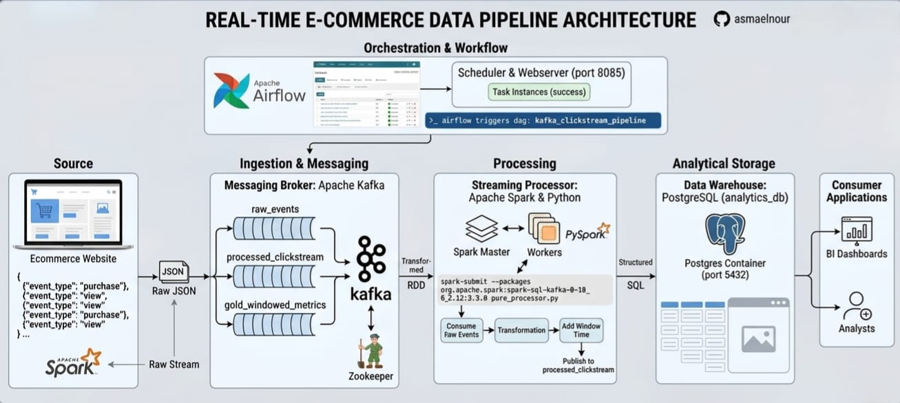

# 🛍️ E-commerce Real-Time Data Pipeline

## 📖 Project Overview
This project implements an end-to-end data engineering pipeline designed to process real-time clickstream data from an e-commerce platform. The pipeline ingests raw events, transforms them, and aggregates metrics for analytical insights.

---

## 🏗️ Architecture
The system leverages a fully Dockerized infrastructure to ensure scalability and ease of deployment.



---

## 🛠️ Tech Stack
* **Orchestration:** Apache Airflow
* **Messaging/Ingestion:** Apache Kafka & Zookeeper
* **Processing:** Apache Spark (PySpark)
* **Storage:** PostgreSQL
* **Infrastructure:** Docker & Docker Compose

---

## 🚀 Evidence of Success

The pipeline has been verified and tested successfully:

### 1. Airflow Orchestration
The `kafka_clickstream_pipeline` DAG is configured and successfully executing tasks.
![Airflow DAG Success]

### 2. Data Processing Verification
The processed data is successfully loaded into the `gold_windowed_metrics` table within the PostgreSQL database, confirming the pipeline's end-to-end functionality.
![PostgreSQL Output]
---

## ⚙️ How to Run
1. Ensure **Docker Desktop** is installed and running.
2. Spin up the infrastructure using:
   ```bash
   docker-compose up -d
3. Access the Airflow UI at: http://localhost:8085
4. Manually trigger the kafka_clickstream_pipeline DAG to start the data flow.

---

## 💡 Key Learnings
Mastering real-time data ingestion using Apache Kafka.

Orchestrating complex workflows with Apache Airflow.

Performing windowed transformations and aggregations using Apache Spark.

Implementing robust data storage solutions with PostgreSQL.

Developed as part of an intensive Data Engineering project.
